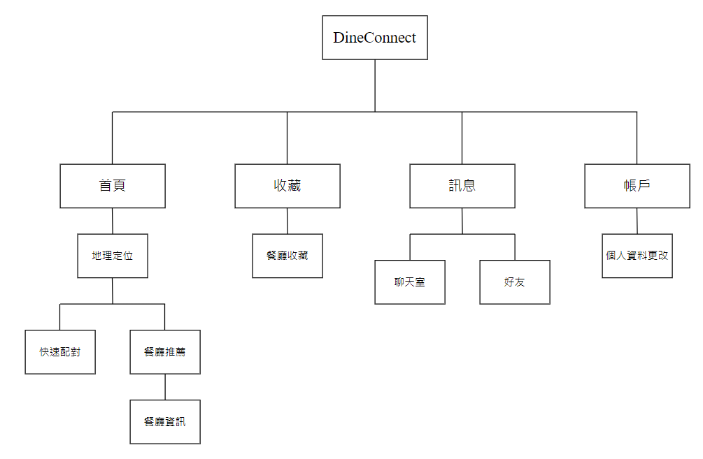
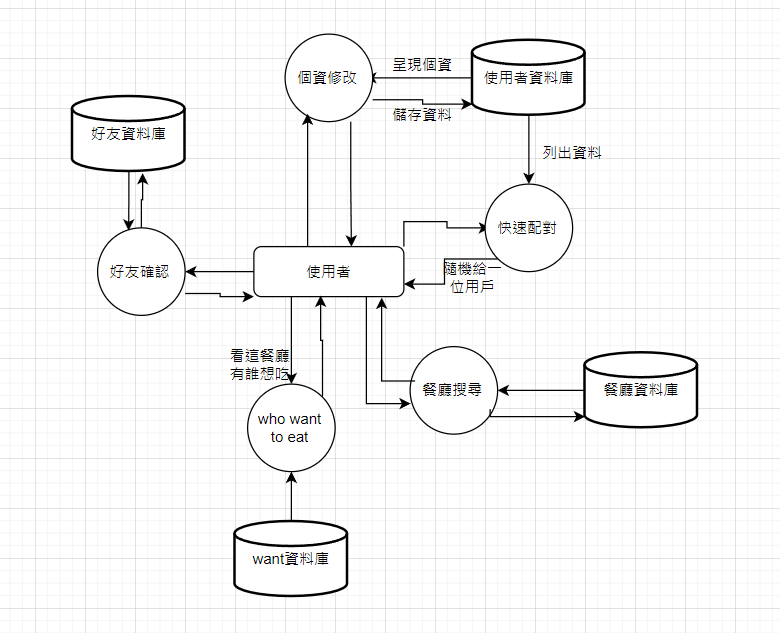

<h1 align="center" style="margin: 30px 0 30px; font-weight: bold;">DineConnect 餐廳推薦與交友APP</h1>
<h4 align="center">在大學生活中，是否有過不想自己吃飯，卻又找不到朋友陪?
在這個前提下，我們打造出了一款應用程式── DineConnect，幫助用
戶找到共進晚餐的夥伴，並替大家減少生活上的寂寞和孤獨感。</h4>

# DineConnect

### 系统简介
為了降低用戶與陌生人共進晚餐的擔憂，制定了以下解決方案:
1. 要求用戶在註冊時提供真實姓名並進行驗證。
2. 根據用戶的興趣和共同的朋友來進行匹配。
3. 推薦餐廳皆位於公共場所，人多的地方。
在功能方面，分為四大部分:
1. 用戶：註冊、登錄、個人資料管理。
2. 飯局：先進行地區、飲食習慣篩選，找出符合的餐廳，再進行二次篩選找出符合的飯友。
3. 聊天：成為飯友後，可以進行後續的交流。
4. 地圖：顯示餐廳位置。
透過DineConnect，使用者可以擁有更愉快的用餐體驗，並為生活增添
樂趣。

### 採用技術

#### React native:
React Native是Facebook開發的框架，主要是讓網頁開發人員用接近寫React的方式以JavaScript撰寫App，React Native再將寫下的JS轉換為原生的程式碼，對於網頁開發人員的好處當然是能以自己習慣
的方式撰寫App，而且還能一次撰寫雙平台的App，大量地減少了摸索的時間。
#### Expo:
Expo 是一個開源框架和平台，用於建置和部署通用的React 應用程式。它簡化了React Native 應用的開發流程，提供了豐富的工具和服務，例如即時刷新、跨平台API、託管服務和無縫整合。透過使用Expo，開發者可以快速建立和發布高效能的iOS 和Android 應用，無需配置複雜的開發環境。
#### MySQL:
MySQL 是一個開源的關聯式資料庫管理系統（RDBMS），由瑞典公司MySQL AB 開發，目前由Oracle Corporation 維護。它使用結構化查詢語言（SQL）進行資料庫訪問和管理，廣泛應用於Web開發、資料
存儲和資料處理等領域。MySQL 以其高效能、穩定性和易用性著稱，支援多種作業系統，並且與許多程式語言和開發工具相容，使其成為許多企業和開發者的首選資料庫解決方案。
#### Java
Java 是廣泛用於編寫Web 應用程式的程式設計語言。它是近二十年來開發人員最愛使用的程式設計工具，如今已有數百萬的Java 應用程式廣為各界使用。Java 是多平台、物件導向且以網路為中心的語
言，其本身亦可作為平台使用。這種程式設計語言既安全又可靠，不論是行動應用程式及企業軟體，乃至大數據應用程式和伺服器端技術，都能用Java 快速的編寫出來。

### 資料庫設計

資料庫總共分四塊，分別是使用者、餐廳、好友以及status want to eats
* 使用者:使用者ID、使用者名字、密碼、性別、年齡、圖片、email
* 餐廳:餐廳ID、餐廳名稱、餐廳評分、餐廳圖片、餐廳地址
* 好友:使用者ID、好友ID、狀態(確認、未確認、封鎖)
* status want to eats(餐廳哪個使用者正在想吃的狀態):餐廳ID、使用者ID

### 系統架構圖

### 系統流程圖

### 畫面展示

### SWOT分析

#### 優點(Strengths):
* 解決社交問題:我們的應用程式可以解決了一個普遍存在的社交問題，即單獨用餐時的孤獨感，有助於提升用戶的生活品質。
* 用戶定向明確:我們的使用者就是著重於想找人家吃飯為主，並且先鎖定為中正大學的學生。
* 餐廳推薦:我們會根據使用者的口味需求，來推薦幾家符合他口味的餐廳。
#### 缺點(Weaknesses):
* 安全問題:安全漏洞可能導致用戶的個人信息泄漏，並且也無法完全保障飯友是否為正常人。
* 隱私擔憂:因為我們有可以查看某間餐廳誰也想吃的功能，因此使用者偏好去哪間餐廳可能會被其他使用者知道。
* 社交接受度: 一些用戶可能不願意公開他們單獨用餐的需求，社交接受度可能是一個潛在的挑戰。
#### 機會(Opportunities):
* 擴大場景：除了用餐外，未來如果有機會也可以擴展到其他社交場景，如娛樂活動、旅行等。
* 合作夥伴關係：可以與餐廳、咖啡廳等飲食場所合作，提供促銷活動，增加應用程式的吸引力。
#### 威脅(Threat):
* 競爭激烈：市場上目前也有類似的應用，可能需要應對激烈的競爭。
* 社交習慣改變： 如果社交習慣發生變化，人們可能更多地選擇在線上尋找社交伴侶，而非使用這樣的實體方式。
